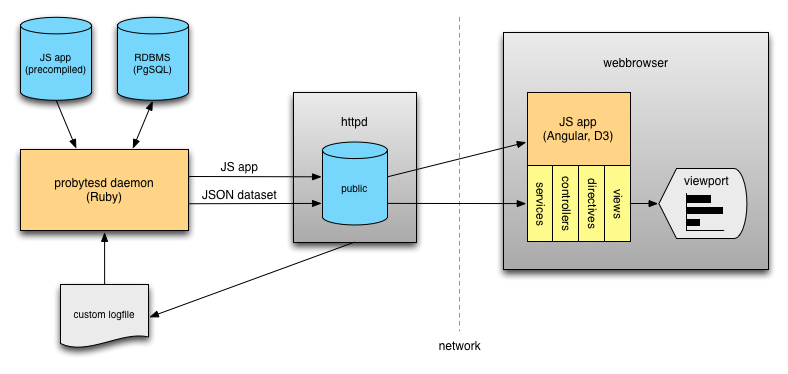

# proper:bytes

Simple and delightful traffic monitoring for your webserver!

## Goals

* Easy to setup, maintain and develop
* Secure
* Optimised for desktop, iPad, Retina displays
* Scale from Megabytes to Petabytes (or whatever)
* [Milestones](https://github.com/improper/probytes/issues/milestones)

## Screenshot

## Components

proper:bytes (p:b) consists of a smallish Ruby daemon for data collection from a custom logfile and a not-so-smallish JavaScript client. The daemon exports a static JSON dataset for consumption by the client, no web accessible server component is required.

### Dataflow

## System requirements

* Some UNIX flavour
* PostgreSQL
* MRI-Ruby 1.9 or compatible with pg and EventMachine
* Server producing a traffic logfile (see below)

## Installation

* [Download](http://pbdist.teralink.net)
* [FreeBSD with nginx](docs/installation-freebsd.md)

## Logfile format

    <hostname> <bytes received> <bytes sent>

One line represents one request.

### Example

    consetetur.org 3492 1393844
    lorem.de 4220 60119
    consetetur.org 3821 920377

## Development

    npm install -g yo grunt-cli bower
    bower install
    grunt server
